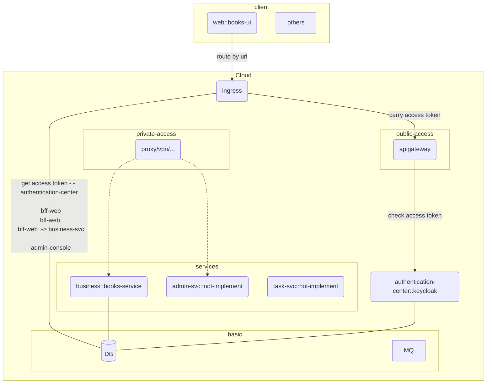

# Solution MicroService Starter

- sample site
  - https://books.pocki.cc `app`
  - https://kubeview.pocki.cc `overall sight of services`
  - helm repo is not public

## TOC

- [Solution MicroService Starter](#solution-microservice-starter)
  - [TOC](#toc)
  - [Introduction](#introduction)
  - [Structure](#structure)
  - [Targets](#targets)
  - [Support Features](#support-features)
  - [Road map](#road-map)
  - [Contact Me](#contact-me)
  - [Thanks to](#thanks-to)
  - [References](#references)

## Introduction

## Structure

## Targets

- High Efficient
  - Code Generation / Code First API
- Easy to maintain, Easy to develop business features
  - Unit Test and EndToEnd Test Coverage => Feature Correctness
  - Automatic Test
- Easy to Cooperate
  - Monorepo
  - Static Types
  - Generated Codes
  - Generated Docs
- Easy for Operations and Monitoring
  - service arranged by kubernetes
  - environment specific configuration
  - gitops: Operations managed by git

## Support Features

- [x] deploy by helm
- [x] static type
- [ ] code gen
  - [x] rest-api(code-first): backend-code --> swagger/openapi schema/docs --> frontend client code
  - [ ] graphql (nodejs)
- [x] monorepo
- [x] configs are transparent to code: config depends on environment
- [ ] test
  - [ ] local test friendly
- [ ] monitor
  - [ ] distributed tracing
  - [ ] logging

## Road map

- [x] sso, auth
  - [x] public/internal access
  - [ ] update account: username/password, user-info
- [ ] polyglot backend
- [x] client code generated by api schema
- [ ] RPC
- [ ] task queue
- [ ] ~~distributed transaction~~

## Contact Me

Mail: pockynwaffle@gmail.com

Looking for backend full/part-time jobs

## Thanks to

- deployment
  - https://github.com/kubernetes/ `deployment solution`
  - https://github.com/helm/helm `deploy tool`
  - https://github.com/k3s-io/k3s/ `real runtime`
- infrastructure
  - https://github.com/keycloak/keycloak `SSO`
  - https://github.com/apache/apisix `application gateway`
- app
  - https://github.com/angular/angular `frontend`
  - https://github.com/nestjs `backend in nodejs`

## References

- https://12factor.net/
- <https://stackoverflow.com/questions/38071714/when-and-how-to-use-graphql-with-microservice-architecture>
- https://xuorig.medium.com/why-we-dont-see-many-public-graphql-apis-ad972bcb201e
- http://biercoff.com/my-small-investigation-about-swagger-codegen-generation-in-typescript/
