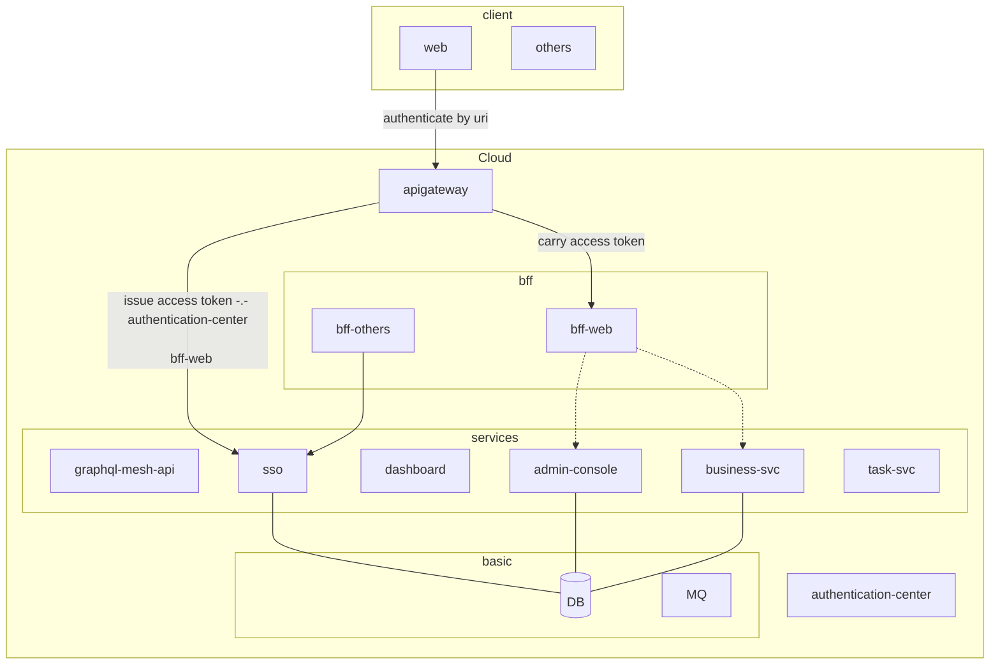

# Solution MicroService Starter

## why microservice?

- 兼容旧有系统
- 协作开发

## structure

## targets

- [ ] 关于代码/项目的可维护性, 扩张能力
  - 如果属于核心服务的代码, 需要能够做到自动化端到端测试, 只有达到这个标准才能有强说服力保证代码功能稳定
  - 但是这个对于代码框架的要求是极高的
- [ ] 便于协作
  - 如果新加入一个服务, 那么如何保证新服务涉及旧服务的集成测试?
    - 所以需要有一个集成测试环境
- [ ] static type
- [ ] code gen
  - [x] rest-api(code-first): backend-code --> swagger/openapi schema/docs --> frontend client code
- [x] monorepo
- [ ] local test friendly
- [ ] monitor
  - [ ] distributed tracing
  - [ ] logging
- [ ] graphql and rest
- [ ] 接口文档swagger/playground, 附带鉴权(类似casdoor的文档, 登录之后才能使用, 同时也便于测试)
- [ ] config transparent to code: config depends on environment

## support features

- frontend
- backend

## road map

- [x] sso, auth
  - [x] public/internal access
  - [ ] update account: username/password, user-info
- [ ] polyglot backend
- [x] client code generated by api schema
- [ ] RPC
- [ ] task queue
- [ ] ~~distributed transaction~~

## Contact Me

Mail: pockynwaffle@gmail.com

Looking for backend full/part-time jobs

## Thanks to

- deployment
  - https://github.com/kubernetes/ `deployment solution`
  - https://github.com/helm/helm `deploy tool`
  - https://github.com/k3s-io/k3s/ `real runtime`
- infrastructure
  - https://github.com/keycloak/keycloak `SSO`
  - https://github.com/apache/apisix `application gateway`
- app
  - https://github.com/angular/angular `frontend`
  - https://github.com/nestjs `backend in nodejs`

## References

- https://12factor.net/
- <https://stackoverflow.com/questions/38071714/when-and-how-to-use-graphql-with-microservice-architecture>
- https://xuorig.medium.com/why-we-dont-see-many-public-graphql-apis-ad972bcb201e
- http://biercoff.com/my-small-investigation-about-swagger-codegen-generation-in-typescript/
