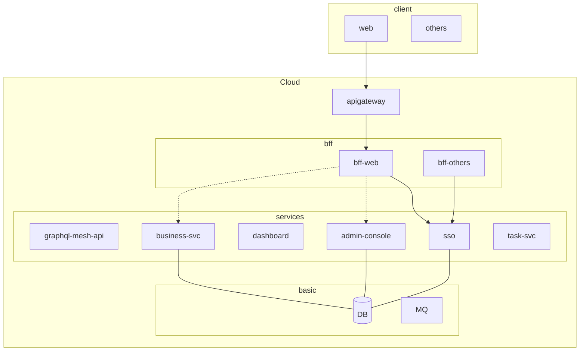

# Solution MicroService Starter

## why microservice?

- 兼容旧有系统
- 协作开发

## targets

- [ ] static type
- [ ] code gen
- [ ] monorepo
- [ ] local test friendly
- [ ] monitor
  - [ ] distributed tracing
  - [ ] logging
- [ ] graphql and rest

## structure

## road map

- [ ] sso

## References

- <https://stackoverflow.com/questions/38071714/when-and-how-to-use-graphql-with-microservice-architecture>
